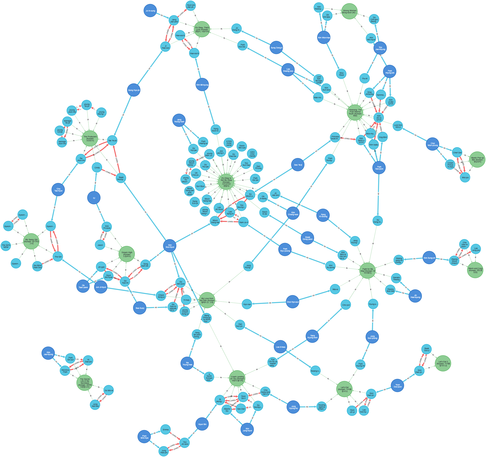

[韓流][Hanryu] [TRACKER][data]	
===


[cypher]: https://neo4j.com/developer/cypher/
[data]: https://docs.google.com/spreadsheets/d/1jfbcvcDfWjKBTsL-sfY0QOJCE33ou75tL_Or-CJ2ijA/edit?usp=sharing
[Hanryu]: https://en.wikipedia.org/wiki/Korean_wave
[`neo4j`]: https://neo4j.com/developer/docker-run-neo4j/
[166]: https://github.com/neo4j/docker-neo4j/issues/166
[48357238]: https://stackoverflow.com/questions/48357238/how-can-i-run-cypher-scripts-on-startup-of-a-neo4j-docker-container
[4.2]: https://neo4j.com/docs/operations-manual/current/docker/introduction/

> Based on [`neo4j:4.2.0`][4.2]

Quickstart
---
1. Build the image and start the [`neo4j`] container
    ```shell script
    export TAG=`date +"%Y%m%d%H%M"`
    docker build -t hanryu/tracker:$TAG .
    export PW= #insert password here
    docker run -p7474:7474 -p7687:7687 -v $(pwd)/import:/import -v $(pwd)/data:/data \
    -e NEO4J_AUTH=neo4j/$PW --user=$(id -u):$(id -g) hanryu/tracker:$TAG
    ```
   
   > Run `docker stop $(docker ps | grep hanryu | cut -d" " -f1)` to stop the container.

Step-by-step
---
1. Start the [`neo4j`] container
    ```shell script
    export PW= #insert password here
    docker run -p7474:7474 -p7687:7687 -v $(pwd)/data:/import -e NEO4J_AUTH=neo4j/$PW neo4j
    ```
    > See [How-To: Run Neo4j in Docker][`neo4j`]

1. Go to [http://localhost:7474/browser/](http://localhost:7474/browser/) on your favourite browser
1. Load data and display (see [cypher] [script](hanryu.cypher))
    ```cypher
    LOAD CSV WITH HEADERS FROM 'file:///Cast.csv' AS row
    UNWIND split(row.Role, ' / ') AS name
    MERGE (role:Role {title: row.Title
    ,                 role:  name
    ,                 actor: row.Actor
    })
    WITH role, row
    MATCH (title:Title {title: row.Title})
    MATCH (actor:Actor {actor: row.Actor})
    // Create relationships between actors, roles and titles
    MERGE (actor)-[:AS]->(role)
    MERGE (role)-[:IN]->(title)
      ON CREATE SET role.Role = row.Role;
   
    // Display
    MATCH p = ()-[]-()-[]-()
    RETURN p
      LIMIT 750
   
    // up to 6 deg of separation
    match p=(:Actor {Actor: 'Park Hyung-sik'})-[*1..6]-(:Title) return p
    ```

References
---
[`stackoverflow`][48357238]
[`docker-neo4j`][166]
